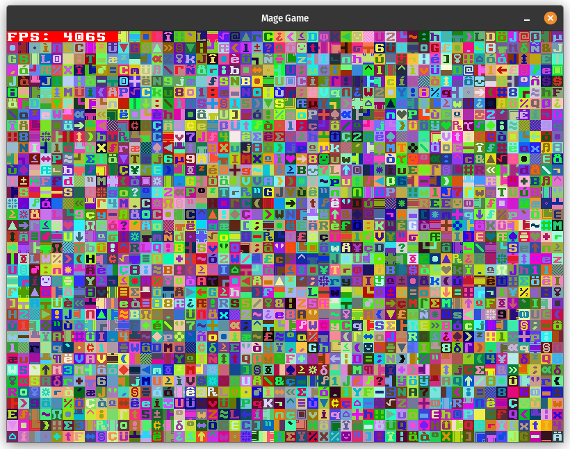
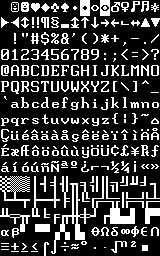

# MAGE Engine Core crate



A 100% safe Rust ASCII game engine for writing text-based tools or tile-based
games similar to traditional Rogue-likes.

This crate manages the Mage `App` trait, the Mage `Config` struct and the
rendering engine.  The rendering engine will use the GPU to render tiles
(typically ASCII characters) to the screen at blazing fast rates.  It can render
30000 characters at around 2000 fps on a nVidia RTX2080 card (so 60 million
characters per second).

The `App` trait provides an interface of two methods: `tick` and `present`.  The
tick method is used for the simulation part of your game.  Delta time, input and
some other information is passed to the host program.  Similarly, the present
method is used for rendering.  Various `u32` slices are passed to the
host to read and write to/from.

The `Config` has information to pass initialisation hints to the engine,
including the tile data, window size etc.

After setting this up, the host application calls `mage_core::run(...)` to kick
off the main loop.

## How it works

The GPU runs a fragment shader that requires 4 textures:

* Font/tile texture
* Character texture
* Foreground colour texture
* Background colour texture

### The font/tile texture

This is an image (typically a PNG image), that contains 256 tile images arranged
in a 16x16 grid.  Below is an example of such an image:



And is in fact the default image used if one is not given.  A single byte can be
mapped to each tile (as there are 256 of them).

### Character texture

The red channel (or lowest 8 bits) of the character texture represents the tile.
This means that the other 24 bits are not used and can, in fact, be used by the
application for whatever purpose.  Each pixel on the texture represents a single
character and the texture dimensions match the number of character cells that
can be fit on to the window.  As the window changes size, this texture is
resized.  The current width and height of this texture (in characters) is passed
to the application for the `present` method.

### Foreground colour texture

Similar to the character texture, each pixel represents a character cell and its
dimensions are the same.  Each `u32` entry represents the foreground colour the
character should take.  The `u32` has the format `ABGR`.  The alpha channel is
ignored and can hold whatever the application wishes.

### Background colour texture

This is the same as the foreground colour texture but determines the background
colour for the character cell.

### Combining it all.

The GPU fragment shader combines the four textures to render the entire screen.
The foreground colour, background colour and character textures combine for each
character cell to determine the colour and contents of that cell.  The contents
are lifted from the font/tile texture according to the index given in the
character texture.  The shader is actually quite simple and can be seen in
`src/shader.wgsl`.

# Building

Building it is quite simple:

```bash
$ cargo build [--release]
```

# Examples

There are various examples included that I used to test the engine and to help
users understand how to use Mage.  For now, this is the sole documentation but I
will endeavour to write a Mdbook later.

Examples are run the usual way:

```bash
$ cargo run --release --example [example name]
```

For example, for an example that tries to use every feature of Mage:

```bash
$ cargo run --release --example basic
```

# Features

* Simple API
* Alt+Enter to toggle fullscreen
* Cross-platform (should work on all major OSes).
* Rendering is 100% GPU once the textures are set up.

# Disclaimer

This is currently work in progress and is not ready for production.  It is
missing vital features including, but not limited to:

* Keyboard and mouse input
* An ECS system
* Audio support
